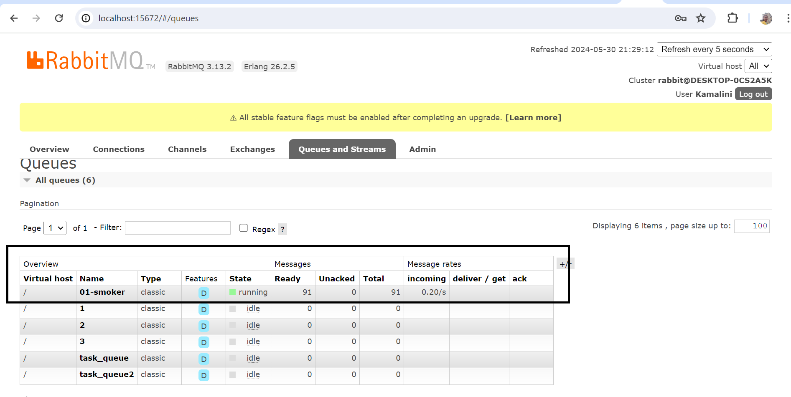
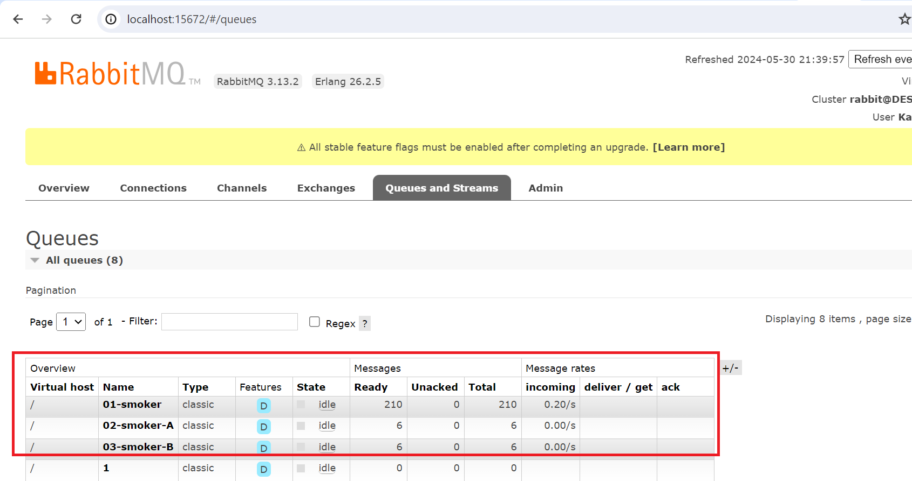
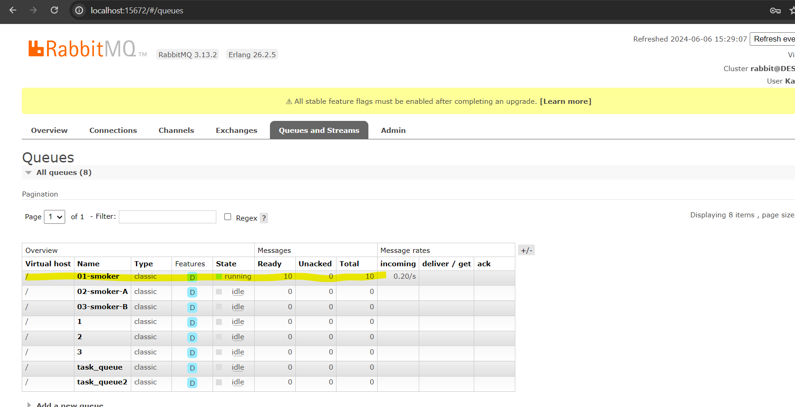
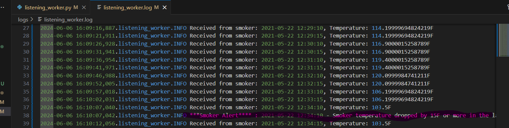
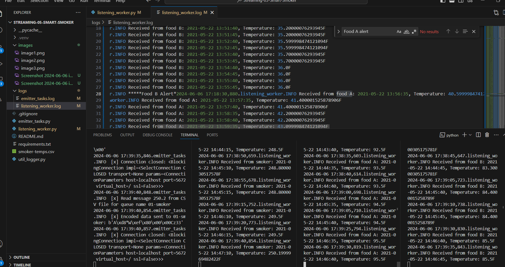
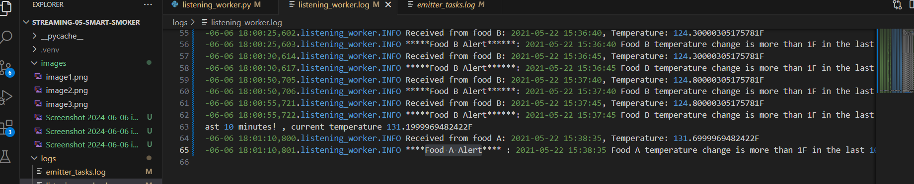

# Streaming-05-Smart-Smoker
streaming-05-smart-smoker project for Data streaming Data in Motion / data real time 

# Creating my own repo to complete the following tasks

1. Implement your bbq producer. More detailed help provided in links below.
1. Use the logic, approach, and structure from Module 4, version 2 and version 3.
1. These provide a current and solid foundation for streaming analytics - modifying them to serve your purpose IS part of the assignment.
1. Do not start from scratch - do not search for code - do not use a notebook.
1. Use comments in the code and repo to explain your work.
1. Use docstring comments and add your name and date to your README and your code files.
1. Explain your project in the README. Include prerequisites and how to run your code.
Document your project works - display screenshots of your console and maybe the RabbitMQ console.
1. If you only have a producer, you won't have a consumer showing messages yet, so you'll need to be creative. We'll build the consumers next.

## Read

1. Read the [RabbitMQ Tutorial - Work Queues](https://www.rabbitmq.com/tutorials/tutorial-two-python.html)
1. Read the code and comments in this repo.

## RabbitMQ Admin 

RabbitMQ comes with an admin panel. When you run the task emitter, reply y to open it. 

(Python makes it easy to open a web page - see the code to learn how.)

## Execute the Producer

1. Run emitter_of_tasks.py with the file name 
If this is the main program being executed (and you're not importing it for its functions), We should call a function to ask the user if they want to see the RabbitMQ admin webpage. We should call a function to begin the main work of the program. As part of the main work, we should Get a connection to RabbitMQ, and a channel, delete the 3 existing queues (we'll likely run this multiple times), and then declare them anew. Open the csv file for reading (with appropriate line endings in case of Windows) and create a csv reader. For data_row in reader: [0] first column is the timestamp - we'll include this with each of the 3 messages below [1] Channel1 = Smoker Temp --> send to message queue "01-smoker" [2] Channe2 = Food A Temp --> send to message queue "02-food-A" [3] Channe3 = Food B Temp --> send to message queue "02-food-B" Send a tuple of (timestamp, smoker temp) to the first queue Send a tuple of (timestamp, food A temp) to the second queue Send a tuple of (timestamp, food B temp) to the third queue Create a binary message from our tuples before using the channel to publish each of the 3 messages. Messages are strings, so use float() to get a numeric value where needed Remember to use with to read the file, or close it when done.
Explore the RabbitMQ website.

## Execute a Consumer / Worker

1. Run listening_worker.py with the Queue 

## Ready for Work

1. Use your emitter_of_tasks to produce more data from csv program to send to Queue .

## Start Listening Worker 

1. Use your listening_worker.py script to launch listining to the message sent

## Reference

- [RabbitMQ Tutorial - Work Queues](https://www.rabbitmq.com/tutorials/tutorial-two-python.html)

## Screenshot

See a running example with at least 3 concurrent process windows here:

