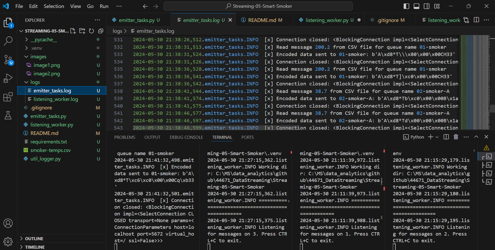

# Streaming-05-Smart-Smoker
streaming-05-smart-smoker project for Data streaming Data in Motion / data real time 

## Read

1. Read the [RabbitMQ Tutorial - Work Queues](https://www.rabbitmq.com/tutorials/tutorial-two-python.html)
1. Read the code and comments in this repo.

## RabbitMQ Admin 

RabbitMQ comes with an admin panel. When you run the task emitter, reply y to open it. 

(Python makes it easy to open a web page - see the code to learn how.)

## Execute the Producer

1. Run emitter_of_tasks.py with the file name 

Explore the RabbitMQ website.

## Execute a Consumer / Worker

1. Run listening_worker.py with the Queue 

Will it terminate on its own? How do you know? 

## Ready for Work

1. Use your emitter_of_tasks to produce more data from csv program to send to Queue .

## Start Listening Worker 

1. Use your listening_worker.py script to launch listining to the message sent

## Reference

- [RabbitMQ Tutorial - Work Queues](https://www.rabbitmq.com/tutorials/tutorial-two-python.html)

## Screenshot

See a running example with at least 3 concurrent process windows here:

